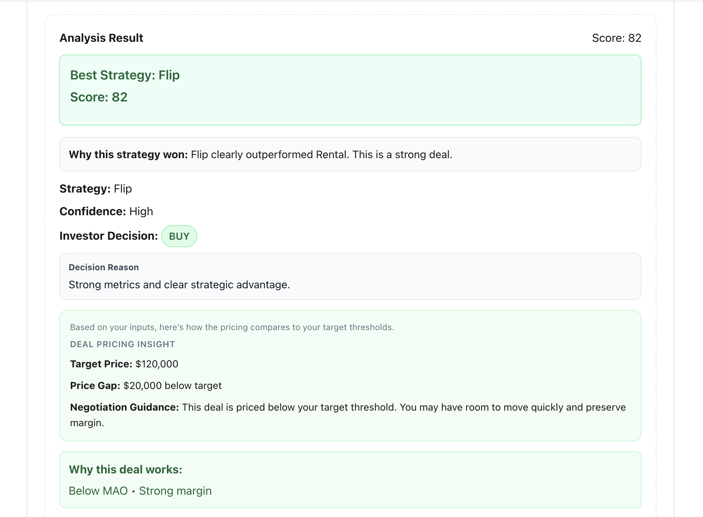
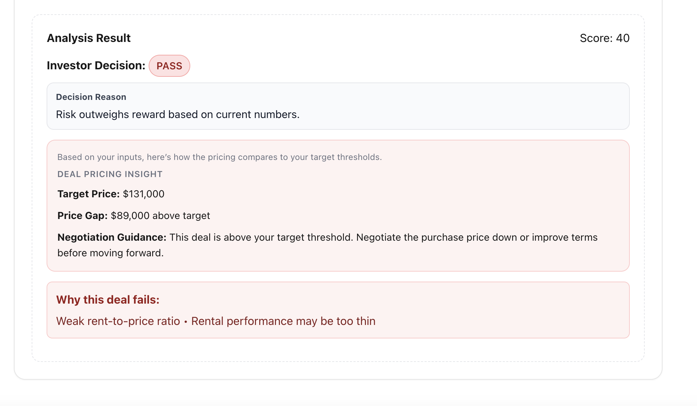

# Deal Analyzer

A strategy-aware real estate deal analyzer that evaluates investment opportunities using structured logic and returns a clear investor decision: **BUY, NEGOTIATE, or PASS**.

---

## Live App

https://deal-analyzer-seven.vercel.app

---

## Overview

Deal Analyzer simulates how an experienced investor evaluates deals by combining:

- Strategy comparison (Flip vs Rental vs Wholesale)
- Score-based decision engine
- Confidence analysis
- Pricing intelligence
- Risk signaling

This is not a calculator — it is a **decision system**.

---

## Core Features

### Decision Engine
- Produces:
  - BUY
  - NEGOTIATE
  - PASS
- Based on score thresholds and confidence logic

---

### Strategy Comparison
- Evaluates:
  - Flip
  - Rental
  - Wholesale
- Determines best strategy dynamically

---

### Confidence System
- High / Medium / Low confidence labeling
- Explanation layer for reasoning transparency

---

### Deal Insight Layer
- “Why this deal works”
- “What to watch”
- “Why this deal fails”

---

### Pricing Intelligence
- Target Price calculation
- Price Gap analysis
- Negotiation guidance

---

## Example Outputs

- Strong deal → BUY + green indicators  
- Borderline deal → NEGOTIATE + yellow indicators  
- Weak deal → PASS + red indicators  

---

## Tech Stack

- Next.js (App Router)
- TypeScript
- React
- Vercel (deployment)

---

## Purpose

This project demonstrates:

- Business logic design
- Decision modeling
- UI state control
- Structured reasoning systems

It is part of a larger system roadmap toward:

- Acquisition IQ (strategy engine)
- Investor OS (full platform)

---

## 📊 Live Deal Analysis Examples

### 🟢 Strong Deal → BUY


---

### 🟡 Borderline Deal (NEGOTIATE)


---

### 🔴 Weak Deal (PASS)


## Local Development

```bash
npm install
npm run dev

---

## Author

Johnny Groves  
Digital Product Builder · AI-Assisted Systems